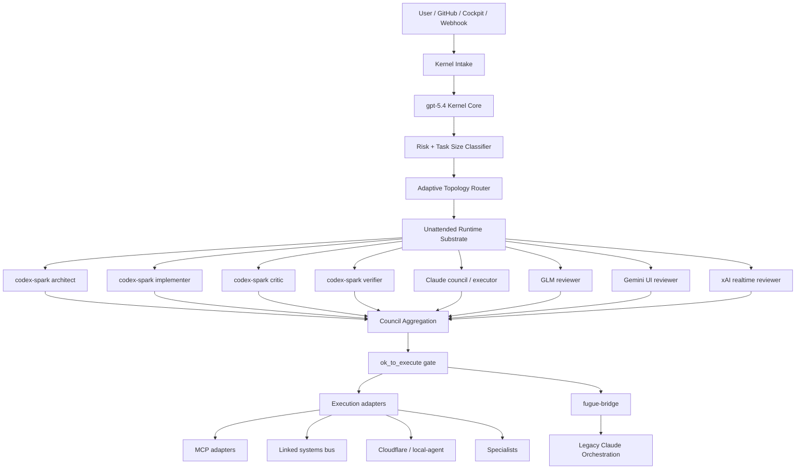

# Kernel Structure

`Kernel` is the Codex-first successor to the legacy Claude orchestration plane.

It keeps the inherited governance model, but centralizes sovereignty in the `gpt-5.4` Kernel while treating Claude, GLM, Gemini, MCPs, and linked systems as bounded adapters.

## Layered View

```text
┌─────────────────────────────────────────────────────────────────────┐
│ User / GitHub Issue / Cockpit / Discord / LINE / Scheduled Input   │
└──────────────────────────────┬──────────────────────────────────────┘
                               │
                               v
┌─────────────────────────────────────────────────────────────────────┐
│ Kernel Intake                                                      │
│ - issue/comment intake                                              │
│ - Cockpit gateway                                                   │
│ - webhook normalization                                             │
│ - risk + task-size classification                                   │
└──────────────────────────────┬──────────────────────────────────────┘
                               │
                               v
┌─────────────────────────────────────────────────────────────────────┐
│ Kernel Sovereign Core                                               │
│ - gpt-5.4 orchestrator                                              │
│ - plan / route / judge / ok_to_execute                              │
│ - adaptive lane topology                                            │
│ - evidence + trace generation                                       │
└──────────────────────────────┬──────────────────────────────────────┘
                               │
                               v
┌─────────────────────────────────────────────────────────────────────┐
│ Kernel Unattended Runtime Substrate                                 │
│ - scheduler / claim / reconcile                                     │
│ - workspace lifecycle                                               │
│ - retry / continuation                                              │
│ - status + recovery surfaces                                        │
└──────────────────────────────┬──────────────────────────────────────┘
                               │
             ┌─────────────────┼──────────────────┐
             │                 │                  │
             v                 v                  v
┌─────────────────────┐ ┌──────────────────┐ ┌──────────────────────┐
│ Proposal Lanes      │ │ Council Lanes    │ │ Sovereign Adapters   │
│ - codex-spark xN    │ │ - Claude         │ │ - codex-sovereign    │
│ - architect         │ │ - GLM            │ │ - claude-compat      │
│ - implementer       │ │ - Gemini (UI)    │ │ - fugue-bridge       │
│ - critic            │ │ - xAI (realtime) │ │                      │
│ - verifier          │ │                  │ │                      │
└──────────┬──────────┘ └─────────┬────────┘ └──────────┬───────────┘
           │                      │                     │
           └──────────────┬───────┴──────────────┬──────┘
                          │                      │
                          v                      v
┌─────────────────────────────────────────────────────────────────────┐
│ Execution + Adapter Plane                                           │
│ - Claude executor / Agent Teams                                     │
│ - MCP adapters                                                      │
│ - linked systems bus                                                │
│ - local-agent / Cloudflare Workers                                  │
│ - specialist tooling                                                 │
└──────────────────────────────┬──────────────────────────────────────┘
                               │
                               v
┌─────────────────────────────────────────────────────────────────────┐
│ Peripheral Surfaces                                                 │
│ - Cloudflare Cockpit / WebSocket / notifications                    │
│ - Discord / LINE / note / video / Obsidian                          │
│ - Supabase / Vercel / Cursorvers protected interfaces               │
└──────────────────────────────┬──────────────────────────────────────┘
                               │
                               v
┌─────────────────────────────────────────────────────────────────────┐
│ Verification + Rollback                                             │
│ - Kernel peripheral simulation                                      │
│ - sovereign adapter switch simulation                               │
│ - fugue-bridge handoff                                              │
│ - evidence logs and run trace                                       │
└─────────────────────────────────────────────────────────────────────┘
```

## Control-Plane Diagram



## Reading Guide

- `Kernel Intake`
  - Normalizes entry points so GitHub, Cockpit, and webhook flows all reach the same Kernel packet contract.
- `Kernel Sovereign Core`
  - The only place that may decide lane topology, approve execution, and emit the final state transition.
- `Kernel Unattended Runtime Substrate`
  - Owns claim/reconcile/workspace/retry mechanics, but must not rewrite governance or create a
    second start-signal path.
- `Proposal Lanes`
  - Speed-focused exploration and implementation candidates, mainly Codex Multiagent and codex-spark.
- `Council Lanes`
  - Independent reviewers that contest or validate the proposal.
- `Execution + Adapter Plane`
  - Where Claude-native skills, MCPs, and linked systems are actually invoked.
- `Verification + Rollback`
  - Kernel is not considered healthy unless simulations pass and `fugue-bridge` remains runnable.

## Related Ops Docs

- [Kernel Recovery Runbook](/Users/masayuki/Dev/fugue-orchestrator/docs/kernel-recovery-runbook.md)
- [Kernel Mini/MBP Operations Topology](/Users/masayuki/Dev/fugue-orchestrator/docs/kernel-mini-mbp-ops-topology.md)
- [Kernel Tailscale / Railway Integration Design](/Users/masayuki/Dev/fugue-orchestrator/docs/kernel-tailscale-railway-integration-design.md)
